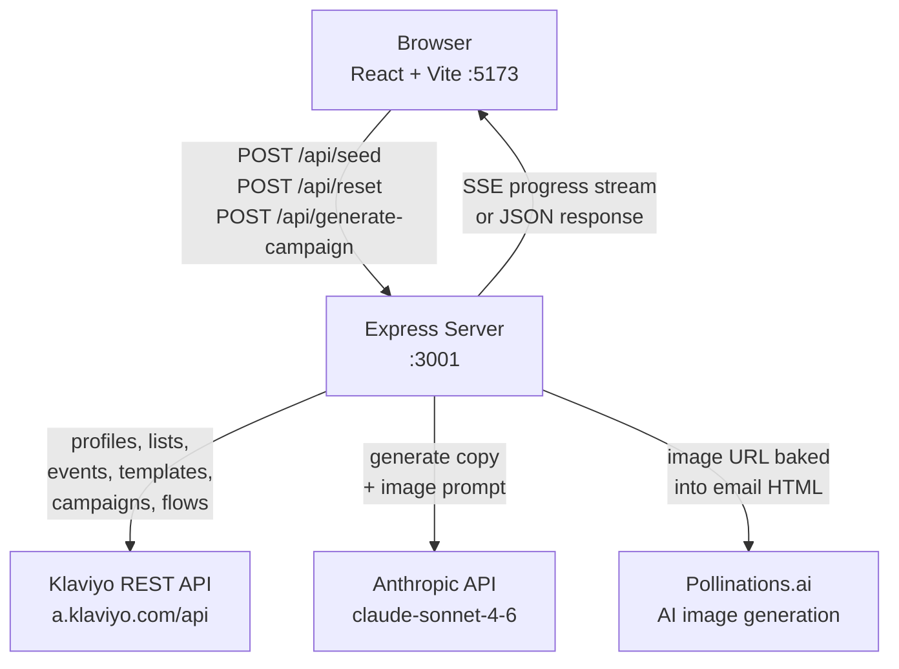
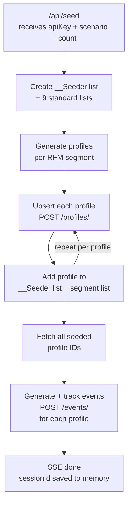
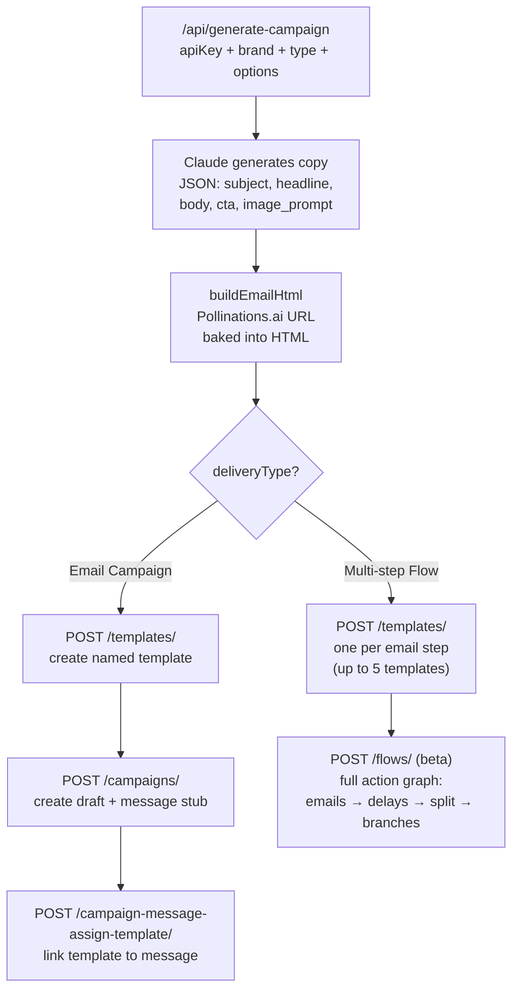

# System Architecture

Three focused diagrams: overall architecture, seeding data flow, and campaign generation data flow.

---

## Overall Architecture

---

## Seeding Data Flow

---

## Campaign Generation Data Flow

