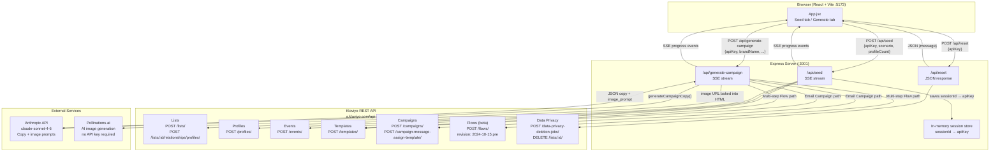

# Data Flow Diagram

High-level view of how data moves through the system.

```mermaid
flowchart TD
    subgraph Browser["Browser (React + Vite :5173)"]
        UI["App.jsx\nSeed tab / Generate tab"]
    end

    subgraph Server["Express Server (:3001)"]
        SEED["/api/seed\nSSE stream"]
        RESET["/api/reset\nJSON response"]
        GEN["/api/generate-campaign\nSSE stream"]
        SESSION["In-memory session store\nsessionId → apiKey"]
    end

    subgraph Klaviyo["Klaviyo REST API\na.klaviyo.com/api"]
        KL_LISTS["Lists\nPOST /lists/\nPOST /lists/:id/relationships/profiles/"]
        KL_PROFILES["Profiles\nPOST /profiles/"]
        KL_EVENTS["Events\nPOST /events/"]
        KL_TEMPLATES["Templates\nPOST /templates/"]
        KL_CAMPAIGNS["Campaigns\nPOST /campaigns/\nPOST /campaign-message-assign-template/"]
        KL_FLOWS["Flows (beta)\nPOST /flows/\nrevision: 2024-10-15.pre"]
        KL_DELETE["Data Privacy\nPOST /data-privacy-deletion-jobs/\nDELETE /lists/:id/"]
    end

    subgraph External["External Services"]
        ANTHROPIC["Anthropic API\nclaude-sonnet-4-6\nCopy + image prompts"]
        POLLINATIONS["Pollinations.ai\nAI image generation\nno API key required"]
    end

    UI -->|"POST /api/seed\n{apiKey, scenario, profileCount}"| SEED
    UI -->|"POST /api/reset\n{apiKey}"| RESET
    UI -->|"POST /api/generate-campaign\n{apiKey, brandName, ...}"| GEN

    SEED -->|"SSE progress events"| UI
    GEN -->|"SSE progress events"| UI
    RESET -->|"JSON {message}"| UI

    SEED --> KL_LISTS
    SEED --> KL_PROFILES
    SEED --> KL_EVENTS
    SEED -->|"saves sessionId → apiKey"| SESSION

    RESET --> KL_DELETE

    GEN -->|"generateCampaignCopy()"| ANTHROPIC
    ANTHROPIC -->|"JSON copy + image_prompt"| GEN

    GEN -->|"image URL baked into HTML"| POLLINATIONS

    GEN -->|"Email Campaign path"| KL_TEMPLATES
    GEN -->|"Email Campaign path"| KL_CAMPAIGNS

    GEN -->|"Multi-step Flow path"| KL_TEMPLATES
    GEN -->|"Multi-step Flow path"| KL_FLOWS
```
