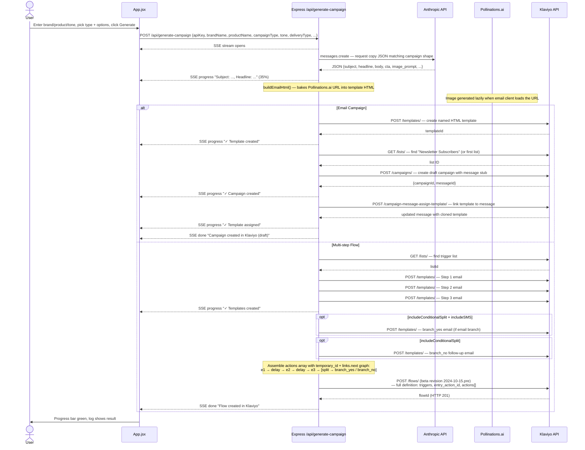

# Sequence Diagram — Generate Campaign

What happens step by step when a user clicks **Generate** on the Generate tab.

Both paths (Email Campaign and Multi-step Flow) are shown.

```mermaid
sequenceDiagram
    actor User
    participant UI as App.jsx
    participant Server as Express /api/generate-campaign
    participant Claude as Anthropic API
    participant Pollinations as Pollinations.ai
    participant Klaviyo as Klaviyo API

    User->>UI: Enter brand/product/tone, pick type + options, click Generate
    UI->>Server: POST /api/generate-campaign {apiKey, brandName, productName, campaignType, tone, deliveryType, ...}
    Server-->>UI: SSE stream opens

    Server->>Claude: messages.create — request copy JSON matching campaign shape
    Claude-->>Server: JSON {subject, headline, body, cta, image_prompt, ...}
    Server-->>UI: SSE progress "Subject: ..., Headline: ..." (35%)

    Note over Server: buildEmailHtml() — bakes Pollinations.ai URL into template HTML
    Note over Pollinations: Image generated lazily when email client loads the URL

    alt Email Campaign

        Server->>Klaviyo: POST /templates/ — create named HTML template
        Klaviyo-->>Server: templateId
        Server-->>UI: SSE progress "✓ Template created"

        Server->>Klaviyo: GET /lists/ — find "Newsletter Subscribers" (or first list)
        Klaviyo-->>Server: list ID

        Server->>Klaviyo: POST /campaigns/ — create draft campaign with message stub
        Klaviyo-->>Server: {campaignId, messageId}
        Server-->>UI: SSE progress "✓ Campaign created"

        Server->>Klaviyo: POST /campaign-message-assign-template/ — link template to message
        Klaviyo-->>Server: updated message with cloned template
        Server-->>UI: SSE progress "✓ Template assigned"

        Server-->>UI: SSE done "Campaign created in Klaviyo (draft)"

    else Multi-step Flow

        Server->>Klaviyo: GET /lists/ — find trigger list
        Klaviyo-->>Server: listId

        Server->>Klaviyo: POST /templates/ — Step 1 email
        Server->>Klaviyo: POST /templates/ — Step 2 email
        Server->>Klaviyo: POST /templates/ — Step 3 email
        Server-->>UI: SSE progress "✓ Templates created"

        opt includeConditionalSplit + includeSMS
            Server->>Klaviyo: POST /templates/ — branch_yes email (if email branch)
        end
        opt includeConditionalSplit
            Server->>Klaviyo: POST /templates/ — branch_no follow-up email
        end

        Note over Server: Assemble actions array with temporary_id + links.next graph:<br/>e1 → delay → e2 → delay → e3 → [split → branch_yes / branch_no]

        Server->>Klaviyo: POST /flows/ (beta revision 2024-10-15.pre)<br/>— full definition: triggers, entry_action_id, actions[]
        Klaviyo-->>Server: flowId (HTTP 201)
        Server-->>UI: SSE done "Flow created in Klaviyo"

    end

    UI->>User: Progress bar green, log shows result
```
