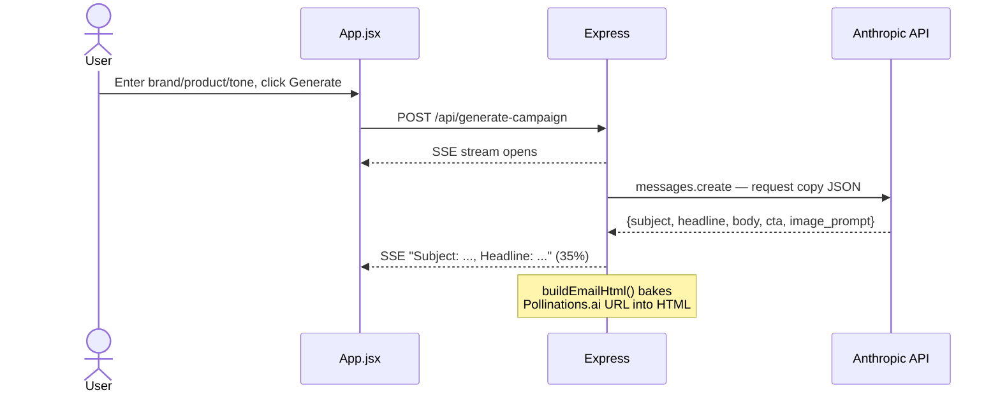
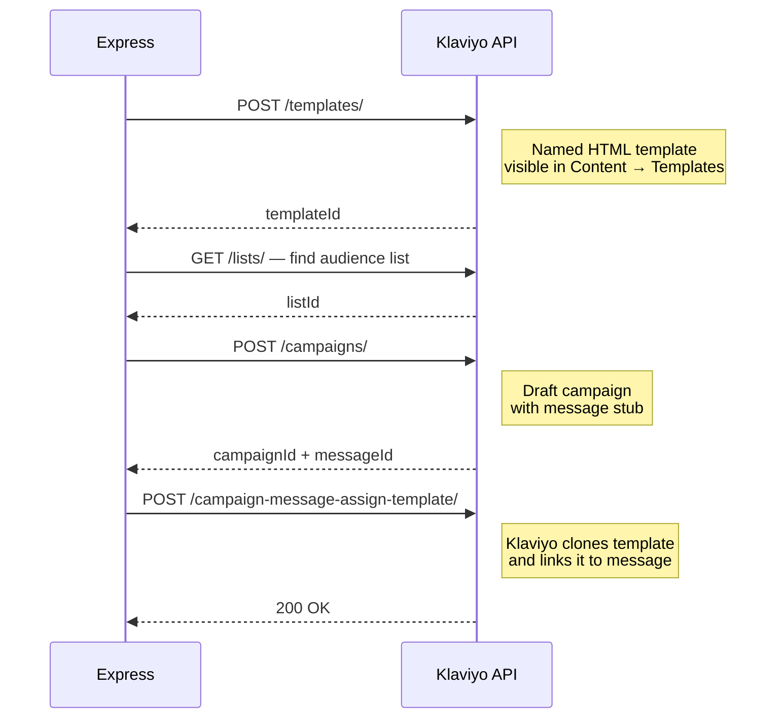
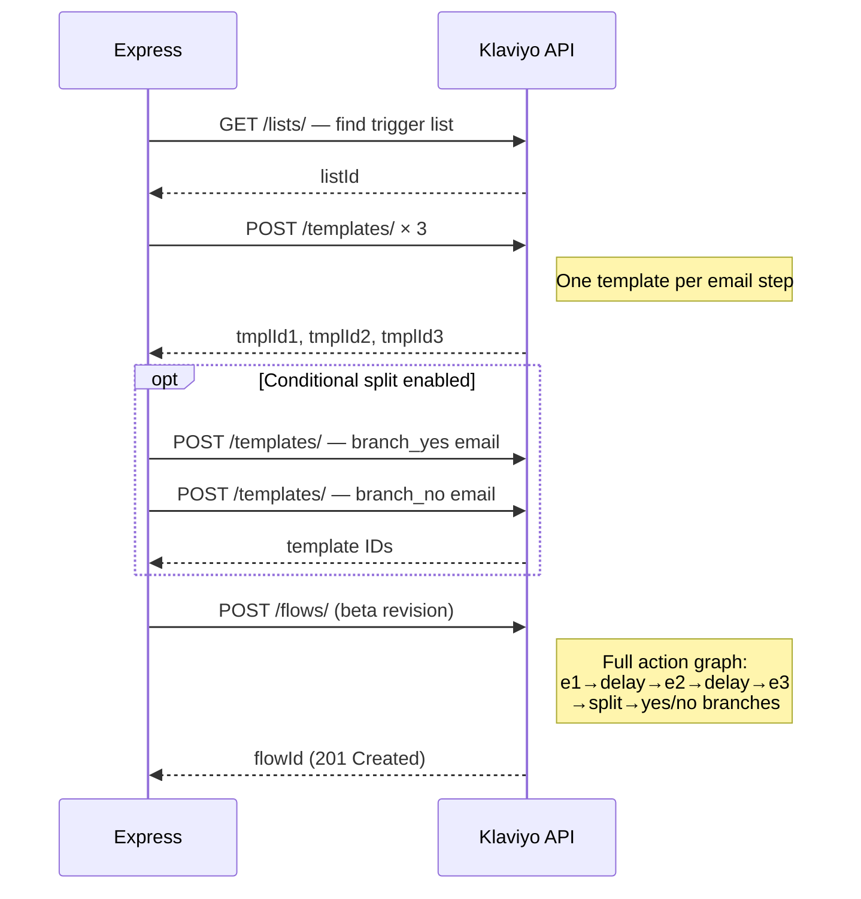

# Sequence Diagram — Generate Campaign

Two paths depending on delivery type selected.

---

## Shared: Copy Generation

```mermaid
sequenceDiagram
    actor User
    participant UI as App.jsx
    participant Server as Express
    participant Claude as Anthropic API

    User->>UI: Enter brand/product/tone, click Generate
    UI->>Server: POST /api/generate-campaign
    Server-->>UI: SSE stream opens

    Server->>Claude: messages.create — request copy JSON
    Claude-->>Server: {subject, headline, body, cta, image_prompt}
    Server-->>UI: SSE "Subject: ..., Headline: ..." (35%)
    Note over Server: buildEmailHtml() bakes<br/>Pollinations.ai URL into HTML
```

---

## Path A: Email Campaign

```mermaid
sequenceDiagram
    participant Server as Express
    participant Klaviyo as Klaviyo API

    Server->>Klaviyo: POST /templates/
    Note right of Klaviyo: Named HTML template<br/>visible in Content → Templates
    Klaviyo-->>Server: templateId

    Server->>Klaviyo: GET /lists/ — find audience list
    Klaviyo-->>Server: listId

    Server->>Klaviyo: POST /campaigns/
    Note right of Klaviyo: Draft campaign<br/>with message stub
    Klaviyo-->>Server: campaignId + messageId

    Server->>Klaviyo: POST /campaign-message-assign-template/
    Note right of Klaviyo: Klaviyo clones template<br/>and links it to message
    Klaviyo-->>Server: 200 OK
```

---

## Path B: Multi-step Flow

```mermaid
sequenceDiagram
    participant Server as Express
    participant Klaviyo as Klaviyo API

    Server->>Klaviyo: GET /lists/ — find trigger list
    Klaviyo-->>Server: listId

    Server->>Klaviyo: POST /templates/ × 3
    Note right of Klaviyo: One template per email step
    Klaviyo-->>Server: tmplId1, tmplId2, tmplId3

    opt Conditional split enabled
        Server->>Klaviyo: POST /templates/ — branch_yes email
        Server->>Klaviyo: POST /templates/ — branch_no email
        Klaviyo-->>Server: template IDs
    end

    Server->>Klaviyo: POST /flows/ (beta revision)
    Note right of Klaviyo: Full action graph:<br/>e1→delay→e2→delay→e3<br/>→split→yes/no branches
    Klaviyo-->>Server: flowId (201 Created)
```
