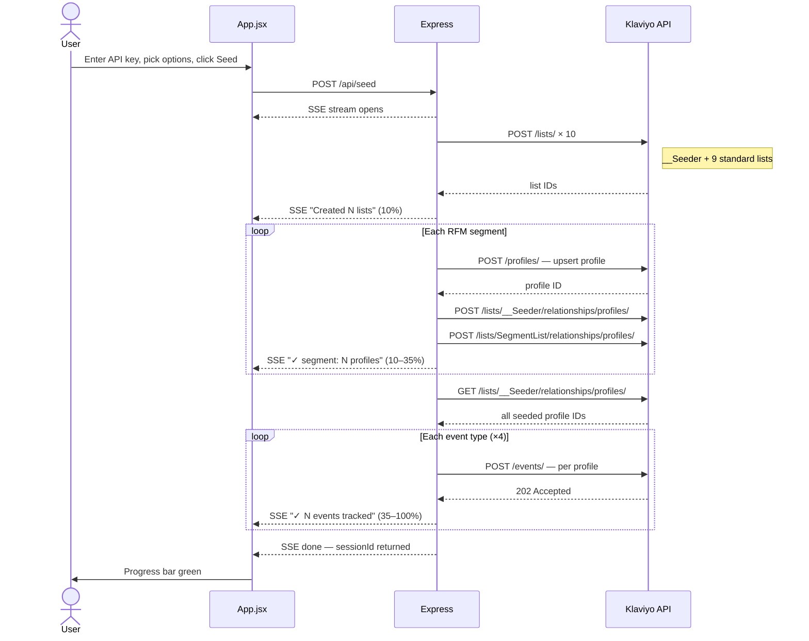

# Sequence Diagram — Seed

```mermaid
sequenceDiagram
    actor User
    participant UI as App.jsx
    participant Server as Express
    participant Klaviyo as Klaviyo API

    User->>UI: Enter API key, pick options, click Seed
    UI->>Server: POST /api/seed
    Server-->>UI: SSE stream opens

    Server->>Klaviyo: POST /lists/ × 10
    Note right of Klaviyo: __Seeder + 9 standard lists
    Klaviyo-->>Server: list IDs
    Server-->>UI: SSE "Created N lists" (10%)

    loop Each RFM segment
        Server->>Klaviyo: POST /profiles/ — upsert profile
        Klaviyo-->>Server: profile ID
        Server->>Klaviyo: POST /lists/__Seeder/relationships/profiles/
        Server->>Klaviyo: POST /lists/SegmentList/relationships/profiles/
        Server-->>UI: SSE "✓ segment: N profiles" (10–35%)
    end

    Server->>Klaviyo: GET /lists/__Seeder/relationships/profiles/
    Klaviyo-->>Server: all seeded profile IDs

    loop Each event type (×4)
        Server->>Klaviyo: POST /events/ — per profile
        Klaviyo-->>Server: 202 Accepted
        Server-->>UI: SSE "✓ N events tracked" (35–100%)
    end

    Server-->>UI: SSE done — sessionId returned
    UI->>User: Progress bar green
```
