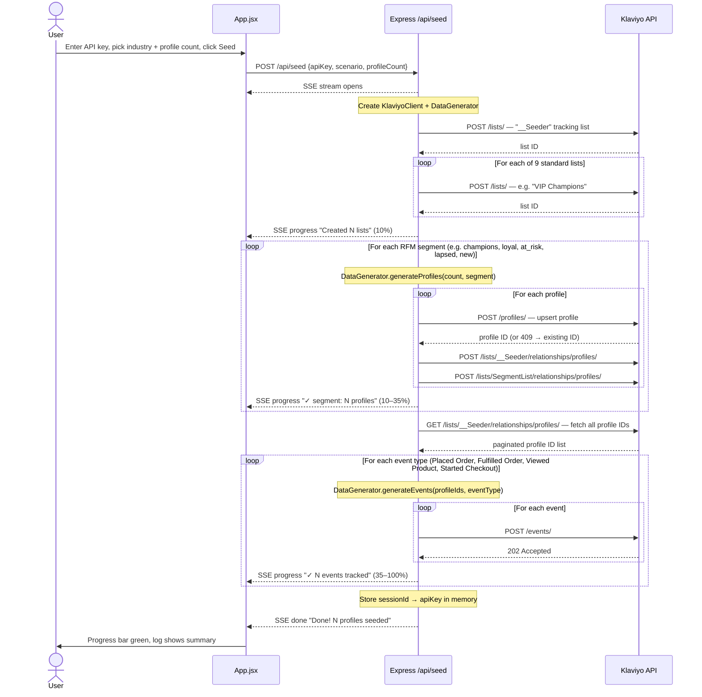

# Sequence Diagram — Seed

What happens step by step when a user clicks **Seed**.

```mermaid
sequenceDiagram
    actor User
    participant UI as App.jsx
    participant Server as Express /api/seed
    participant Klaviyo as Klaviyo API

    User->>UI: Enter API key, pick industry + profile count, click Seed
    UI->>Server: POST /api/seed {apiKey, scenario, profileCount}
    Server-->>UI: SSE stream opens

    Note over Server: Create KlaviyoClient + DataGenerator

    Server->>Klaviyo: POST /lists/ — "__Seeder" tracking list
    Klaviyo-->>Server: list ID
    loop For each of 9 standard lists
        Server->>Klaviyo: POST /lists/ — e.g. "VIP Champions"
        Klaviyo-->>Server: list ID
    end
    Server-->>UI: SSE progress "Created N lists" (10%)

    loop For each RFM segment (e.g. champions, loyal, at_risk, lapsed, new)
        Note over Server: DataGenerator.generateProfiles(count, segment)
        loop For each profile
            Server->>Klaviyo: POST /profiles/ — upsert profile
            Klaviyo-->>Server: profile ID (or 409 → existing ID)
            Server->>Klaviyo: POST /lists/__Seeder/relationships/profiles/
            Server->>Klaviyo: POST /lists/SegmentList/relationships/profiles/
        end
        Server-->>UI: SSE progress "✓ segment: N profiles" (10–35%)
    end

    Server->>Klaviyo: GET /lists/__Seeder/relationships/profiles/ — fetch all profile IDs
    Klaviyo-->>Server: paginated profile ID list

    loop For each event type (Placed Order, Fulfilled Order, Viewed Product, Started Checkout)
        Note over Server: DataGenerator.generateEvents(profileIds, eventType)
        loop For each event
            Server->>Klaviyo: POST /events/
            Klaviyo-->>Server: 202 Accepted
        end
        Server-->>UI: SSE progress "✓ N events tracked" (35–100%)
    end

    Note over Server: Store sessionId → apiKey in memory
    Server-->>UI: SSE done "Done! N profiles seeded"
    UI->>User: Progress bar green, log shows summary
```
